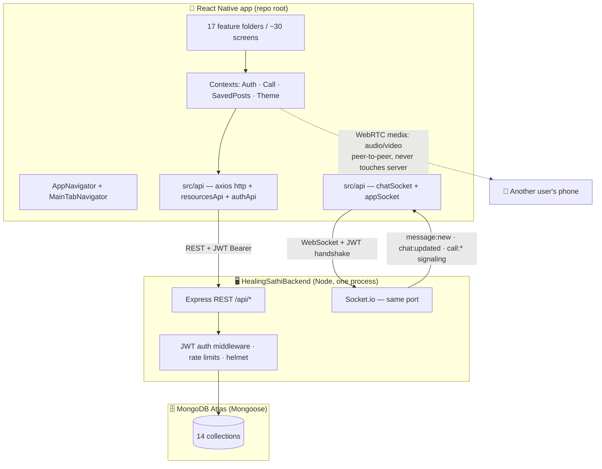

# 1 · Complete App Architecture (as of 2026-07-12)

_The bird's-eye view. For the file-by-file walkthrough in plain language, read `5-endToEndTech.md`._

## The whole system on one diagram

**Three big facts to hold onto while reading code:**
1. **One backend process** serves REST *and* Socket.io on the same port. Writes go over REST (validation + rate limiting in one place); realtime events go out over sockets.
2. **The app has two data modes** — signed out = built-in dummy data ("Try the Demo", works offline); signed in = only real backend data. One hook, `useLiveOrDemo`, enforces this everywhere.
3. **Media is base64-in-MongoDB for now** (photos in posts, chats, avatars). Deliberate MVP transport; cloud storage is the #1 planned upgrade (see file 3 & 4).

---

## Frontend architecture (`/src`)

### Layers, top to bottom

| Layer | Where | What it does |
|---|---|---|
| Navigation | `navigation/AppNavigator.tsx` (stack) + `MainTabNavigator.tsx` (custom PagerView tabs: Home·Groups·Chats·Help·Profile) | All routes + typed params (`RootStackParamList`). Tabs support deep-linking: `navigate("MainTabs", { tab: "Chats" })` |
| Screens | `features/<domain>/` — admin, auth, call, chat, consultants, diary, groups, help, home, notifications, onboarding, posts, profile, profileSetup, search, settings, tips | One folder per product domain |
| Shared UI | `components/ui/` — PostCard, ImageCarousel, AutoHeightImage, CommentsSheet, ShareSheet, UserAvatar, buttons/inputs/chips… | Every screen composes these; styling via theme tokens |
| State | `context/` — **AuthContext** (session, tokens, user), **CallContext** (WebRTC engine + call state machine), **SavedPostsContext**, **ThemeContext** (system/light/dark) | App-wide state only; screen state stays local |
| Data hooks | `hooks/useLiveOrDemo.ts` (the demo/live rule + focus-refetch + polling), `hooks/useComments.ts` (threaded comments tree + optimistic replies/likes) | The two most-reused pieces of logic in the app |
| API | `api/http.ts` (axios + auto token refresh) · `authApi.ts` · `resourcesApi.ts` (every endpoint) · `tokenStorage.ts` · `chatSocket.ts` (per-room) · `appSocket.ts` (app-wide, calls) · `config.ts` (BASE_URL/SOCKET_URL) | Screens never import axios directly |
| Utilities | `utils/` — pickImage (gallery/camera → compressed base64), timeAgo, dummyPost (demo data), constants | |
| Theme | `theme/` — ThemeContext, tokens (single brand #7453C8), typography, radius; every screen uses the `makeStyles(colors)` pattern | Light + dark everywhere |

### Patterns you'll meet in every screen
- **`useLiveOrDemo(fetcher, demoData)`** — returns live data when authenticated, demo data when not; refetches on screen focus; optional silent polling (feed 20s, chats 15s).
- **`makeStyles(colors)`** — StyleSheet factory taking theme colors, so dark mode is automatic.
- **Optimistic UI + server reconcile** — reactions/comments/sends update instantly, then the server's authoritative response corrects counts (backend returns them on purpose).

---

## Backend architecture (`/HealingSathiBackend/src`)

### Request lifecycle
`server.ts` (connect Mongo → listen → initRealtime) → `app.ts` (helmet → CORS → 25mb JSON → logging → rate limits → routers → 404 → errorHandler)

### Routers (`routes/`)

| File | Mounted at | Owns |
|---|---|---|
| `auth.ts` | `/api/auth` | signup/signin, refresh-token rotation, me (GET/PATCH incl. avatarUrl), forgot/reset password, email-code sign-in, Google sign-in, change email/password |
| `posts.ts` | `/api/posts` | feed (social graph + **condition-based discovery**), multi-destination create (feed + groups), **multi-photo `images[]` max 10**, threaded comments w/ `parentId`, atomic reactions on posts *and* comments, save |
| `groups.ts` | `/api/groups` | directory, join toggle, members list, group proposals (→ admin queue) |
| `chats.ts` | `/api/chats` | conversations, messages (text · photo · **sharedPost card**), realtime fan-out after save |
| `sathi.ts` | `/api/sathi` | friend requests state machine; **accept auto-creates the conversation** |
| `users.ts` | `/api/users` | people search, block/unblock, **public profile** (member-since, posts, liked posts, relation) |
| `admin.ts` | `/api/admin` | superuser review queue: approve/reject group proposals & consultant applications (role "admin" only) |
| `misc.ts` | `/api` | notifications, consultants+bookings, consultant applications, health tips |

### Realtime (`realtime.ts`)
- JWT-authenticated handshake; personal room `user:{id}` + per-conversation rooms `chat:{id}` (membership re-checked on join).
- Chat: `message:new` to the room, `chat:updated` nudge to the other participant.
- **WebRTC signaling**: `call:invite/answer/ice/decline/end` relayed between user rooms; every event re-checks the two users share a conversation (60s cached); media itself never touches the server.

### Data model (`models/index.ts` — all 14 schemas in one scannable file)
**User** (role member|admin, sathis[], blockedUsers[], avatarUrl) · **RefreshToken** (revocable sessions, TTL) · **PasswordReset** / **LoginCode** (hashed 6-digit codes, attempt-capped, TTL) · **SathiRequest** · **Group** (status active|proposed|rejected + proposal subdoc) · **Post** (images[] ≤10, embedded comments w/ parentId + supports, reactions) · **Conversation** / **Message** (text·image·sharedPost) · **Consultant** / **ConsultantApplication** / **Booking** · **Notification** · **HealthTip**

### Security posture (already in place)
JWT access (15m) + rotating single-use refresh tokens · bcrypt · timing-safe sign-in · neutral "if that email exists" responses · per-IP rate limits (strict on auth) · blocked-either-way returns 404 (blocking is never confirmable) · admin role grantable only via seed/DB · foreign conversations 404 (no id enumeration) · request-body validation on every string (`utils/validate.ts`)

### Verification
`npm run test:smoke` boots the real app on an **in-memory MongoDB** and drives every flow over real HTTP + sockets — **117 checks**, green. This file is the best executable documentation of the API: `src/smokeTest.ts`.
