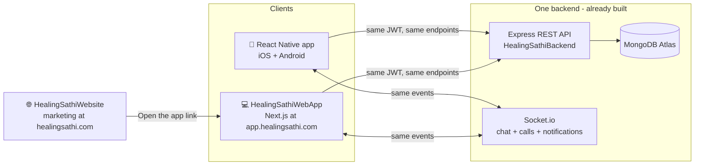

# MainWebsite.md — The HealingSathi Web App

**One product, three doors.** iPhone app, Android app, and now a full working
website — the same account, the same feed, the same chats, the same everything.
Like Facebook: `facebook.com` isn't a brochure, it IS Facebook. This document is
the complete architecture + design for `HealingSathiWebApp` — read it, approve it,
and building starts.

> **Not the marketing site.** `HealingSathiWebsite/` (the existing Next.js
> brochure with the waitlist form) stays exactly what it is — the front door at
> `healingsathi.com`. This document describes a NEW project: the logged-in
> product, living at **`app.healingsathi.com`**, in a new folder
> **`HealingSathiWebApp/`**. The marketing site's "Open HealingSathi" button will
> simply link to it. (Same split Facebook uses: about.facebook.com vs
> facebook.com.)

---

## 1. The big picture



**The single most important fact:** the backend is already done. Every feature
the app has works through `HealingSathiBackend`'s REST API + Socket.io, and the
web app talks to the **exact same server with the exact same calls**. There is no
"web backend" to build. Sign in on your phone, post from your laptop, get the
comment notification back on your phone — it's one database, so sync is automatic.

**What actually has to be built:** one thing — a browser frontend. That's this doc.

---

## 2. Where it lives & the stack

| Decision | Choice | Why |
|---|---|---|
| Folder | `HealingSathiWebApp/` at repo root | Sibling of `HealingSathiBackend/` and `HealingSathiWebsite/`; the repo root is the RN app so it can't live there |
| Domain | `app.healingsathi.com` | Marketing keeps `healingsathi.com`; clean cookie/origin separation |
| Framework | **Next.js (App Router) + TypeScript** | Same family as the marketing site (shared knowledge), file-based routing gives every post/profile/group a real URL |
| Rendering | Client-side data fetching behind auth (no SSR of private data) | The feed is personal and JWT-authed — SSR adds complexity for zero SEO gain (private content shouldn't be indexed anyway) |
| Styling | **Tailwind v4** + design tokens copied from the app | Marketing site already proved this setup; tokens below |
| Data fetching | **TanStack Query (React Query)** | Gives the web the same "refetch 
on focus + background polling" behavior `useLiveOrDemo` gives the app, plus caching and optimistic updates for free |
| API client | `axios` instance ported from `src/api/http.ts` | The interceptor logic (attach token → 401 → single-flight refresh → retry) is already written and battle-tested; it ports almost line-for-line |
| Realtime | `socket.io-client` | Identical events the app already uses (`message:new`, `chat:updated`, `call:*`) |
| Auth/session state | Small `AuthProvider` (React context), tokens in `localStorage` | Mirrors the app's `tokenStorage` + `AuthContext`; upgrade path to httpOnly cookies noted in §9 |
| Theme | `next-themes` (system / light / dark) | Same three-way toggle the app's Settings has |
| Deploy | Vercel (like the marketing site's plan) | One `git push` = deployed; free tier is fine to start |

**Backend changes needed: two lines of env, zero code.**
1. `CORS_ORIGIN=https://app.healingsathi.com,http://localhost:3000` — the
   allowlist already exists in `env.ts`, it just needs the web origins.
2. Add the Google **web** OAuth client id to `GOOGLE_CLIENT_IDS` (the endpoint
   already accepts a list).

---

## 3. Design system — it must FEEL like the app

The app already has a settled visual identity (single brand accent, calm
"healing" language, light/dark). The web copies it token-for-token so a user
switching between phone and laptop never feels a brand jump.

### Tokens (copied verbatim from `src/theme/colors.ts`)

| Token | Light | Dark | Used for |
|---|---|---|---|
| `--primary` | `#7453C8` | `#9A82E0` | Buttons, active states, links |
| `--primary-dark` | `#5A3DA0` | `#7453C8` | Gradients (own chat bubbles) |
| `--background` | `#F5F8FD` | `#13141A` | Page background |
| `--card` | `#FFFFFF` | `#1D1F29` | Cards, sheets, panels |
| `--text` | `#1F334D` | `#EEF1F8` | Primary text |
| `--muted` | `#6F87A6` | `#8D9BB5` | Secondary text, timestamps |
| `--border` | `#DDE5F2` | `#2B2E3A` | Hairline borders |
| `--light-purple` | `#EEE7FF` | `#2A2440` | Active tab pill, tints |
| `--light-blue` | `#EFF4FC` | `#1E2430` | Inputs, their-bubbles |
| `--success` / `--danger` | `#4FA57B` / `#E36A6A` | both | Sent ✓ / delete & unread badge |

Rules carried over from the marketing-site work (learned the hard way there):
- Class merging in shared components goes through **`cn()` (tailwind-merge)**,
  never raw string concat — otherwise variant classes silently beat overrides.
- Never use a theme-flipping token (like `--text`) as a background that must look
  identical in both themes — use a fixed token for that case.

### Component inventory — app → web

Every app component gets a web sibling with the same name, so the codebases rhyme:

| App (`src/components`, screens) | Web component | Notes |
|---|---|---|
| `PostCard` (+ ⋯ menu, reactions) | `<PostCard>` | Identical layout; hover states added; ⋯ menu becomes a dropdown |
| `ImageCarousel` | `<ImageCarousel>` | Arrows on hover + dots; swipe on touch |
| `CommentsSheet` / `CommentItem` | `<CommentThread>` | Not a bottom sheet on desktop — comments render inline under the post (Facebook-style); bottom sheet only on mobile web |

| `ShareSheet` (quick row + picker) | `<ShareDialog>` | Modal dialog; same top-5 + multi-select picker + "copy link" (links are REAL on web — see §6) |
| `UserAvatar` | `<UserAvatar>` | Initials fallback + photo, identical colors |
| `ChatMessageBanner` | `<Toast>` + browser `Notification` | Web can also notify when the tab is in the background — better than the app until push lands |
| `CallOverlay` | `<CallOverlay>` | Same UI; browser-native WebRTC (§7) |
| `AppToggle`, `SearchBar`, `PrimaryButton`, `TagChip` | same names | Straight ports |

---

## 4. Layout — the Facebook-shaped shell

### Desktop (≥1024px): three columns, fixed shell, only the middle scrolls

```
┌────────────────────────────────────────────────────────────────────────┐
│  🟣 HealingSathi     [ 🔍 Search people, groups... ]      💬(3) 🔔(2) 🧑 │  ← top bar
├──────────────┬──────────────────────────────────┬──────────────────────┤
│  LEFT NAV    │            CENTER                │      RIGHT RAIL      │
│              │                                  │                      │
│  🏠 Home     │  ┌────────────────────────────┐  │  My Sathis           │
│  👥 Groups   │  │ What's on your mind?  📷   │  │   ● Alex K.    💬    │
│  💬 Chats(3) │  └────────────────────────────┘  │   ● Maya H.    💬    │
│  🩺 Help     │  ┌────────────────────────────┐  │                      │
│  🧑 Profile  │  │ PostCard                   │  │  My Groups           │
│  ──────────  │  │  author · time             │  │   Fibromyalgia W.    │
│  📔 Diary    │  │  text + photo carousel     │  │   Type 2 Diabetes    │
│  💡 Tips     │  │  ♥ 12   🤝 4   💬 6   ↗    │  │                      │
│  ⚙ Settings  │  └────────────────────────────┘  │  Suggested for you   │
│              │  ┌─ PostCard ─────────────────┐  │   (condition-based   │
│              │  │  ...feed continues...      │  │    discovery)        │
└──────────────┴──────────────────────────────────┴──────────────────────┘
```

- Left nav = the app's 5 tabs + the screens the app tucks behind Home quick
  actions (Diary, Tips, Settings). Chats shows the same **unread count badge**
  the app's tab bar shows — same socket event drives both.
- Right rail = the app's "My Friends / My Groups" directory + condition-based
  suggestions, always visible (this is what big screens are FOR).
- Top bar = brand, global search (the app's SearchScreen, always one keystroke
  away — `/` focuses it), chat + notification bells with live badges, avatar menu.

### Chat (≥1024px): the two-pane Messenger layout — web's biggest win

```
┌──────────────────────┬─────────────────────────────────────────────────┐
│  Chats     [search]  │  Alex K.  · Online                    📞  🎥    │
│ ┌──────────────────┐ │ ─────────────────────────────────────────────── │
│ │● Alex K.      (2)│ │           ┌──────────────────────┐              │
│ │  📷 Photo · 2m   │ │           │ their message bubble │              │
│ ├──────────────────┤ │           └──────────────────────┘              │
│ │  Maya H.         │ │              ┌───────────────────────────┐      │
│ │  Finally found…  │ │              │ your gradient bubble    ✓✓│      │
│ ├──────────────────┤ │              └───────────────────────────┘      │
│ │  …               │ │                                                 │
│ └──────────────────┘ │  [ + ]  [ Write something supportive…  ] [ ➤ ] │
└──────────────────────┴─────────────────────────────────────────────────┘
```

Conversation list and the open thread side-by-side — no back-and-forth
navigation. The app's whole chat feature set carries over: photos, shared-post
mini cards (tappable → the post), unread zeroing on open, socket receive with
15s polling fallback, call buttons.

### Tablet (768–1023px): left nav collapses to icons, right rail hides.

### Mobile web (<768px): the app's own layout — bottom tab bar (Home, Groups,
Chats, Help, Profile), single column, bottom-sheet comments/share. Someone
opening a shared link on their phone browser gets an experience nearly identical
to the native app (plus a gentle "get the app" banner).

---

## 5. Complete page map

Every route, what it shows, and which existing API it calls. **No new endpoints
are needed for any row** (the two ⚠ rows reuse existing ones with notes).

| Route | What it is (app equivalent) | APIs used |
|---|---|---|
| `/` | Redirect: signed-in → `/feed`, else → `/login` | — |
| `/login`, `/signup` | AuthScreen (both tabs, own form state) | `POST /auth/signin`, `/auth/signup` |
| `/login/code` | EmailCodeScreen | `POST /auth/email-code/request`, `/verify` |
| `/login/forgot` | ForgotPasswordScreen | `POST /auth/forgot-password`, `/reset-password` |
| `/login` (Google button) | Google Sign-In | `POST /auth/google` (web id token via Google Identity Services) |
| `/feed` | HomeScreen: composer strip, live feed, pull-equivalent (auto refetch), honest empty state | `GET /posts`, `POST /posts/:id/react`, `/save` |
| `/post/[id]` | PostDetailsScreen — **now a real shareable URL** | `GET /posts/:id`, comments + reactions endpoints |
| `/post/[id]/edit` | EditPostScreen (own posts) | `PATCH /posts/:id` |
| `/compose` (modal over feed) | CreatePostScreen: multi-photo (≤10), destination chips (Feed + joined groups), content warning | `POST /posts` |
| `/groups` | GroupsScreen directory + "Request a group" | `GET /groups`, `POST /groups/:id/join`, `/groups/request` |
| `/groups/[id]` | GroupDetailsScreen: Posts / Members / About tabs, + Post FAB preselect | `GET /posts?groupId=`, `GET /groups/:id/members` |
| `/chats` | ChatsScreen (list pane; on desktop always visible) | `GET /chats`, `POST /chats/:id/read` |
| `/chats/[id]` | ChatRoomScreen (thread pane): text, photos, shared posts, calls | `GET/POST /chats/:id/messages`, socket `message:new` |
| `/help` | PsychologicalHelpScreen: consultant directory | `GET /consultants` |
| `/help/consultant/[id]` | ConsultantProfileScreen + reviews | `GET /consultants` ⚠ (no single-consultant endpoint; filter client-side like the app does) |
| `/help/book/[id]` | BookingScreen | `POST /bookings`, `GET /bookings` |
| `/help/apply` | BecomeConsultantScreen | `POST/GET /consultants/apply` |
| `/profile` | ProfileScreen: hero + avatar upload, My Posts / Saved tabs | `GET /posts?mine=1`, `/posts/saved`, `PATCH /auth/me` |
| `/user/[id]` | UserProfileScreen (read-only public profile, Message / + Add Sathi) | `GET /users/:id/profile`, `POST /chats` |
| `/search` | SearchScreen (also inline from the top bar) | `GET /users/search`, `/groups`, `/consultants` |
| `/notifications` | NotificationsScreen: tabs, sathi request cards, mark-all-read | `GET /notifications`, `/sathi/requests`, respond endpoints |
| `/tips` | HealthTipsScreen | `GET /tips` |
| `/diary` | HealingDiaryScreen ⚠ (app stores it on-device; web stores in `localStorage` the same way — private-by-design carries over; cloud sync stays a backlog item for BOTH) | — |
| `/settings` | SettingsScreen: account rows, theme, chat-notifications toggle, blocked users, language | `PATCH /auth/me`, `GET /users/blocked`, etc. |
| `/settings/delete-account` | DeleteAccountScreen: exit reasons + feedback + password | `DELETE /auth/me` |
| `/admin` | AdminReviewScreen (admins only; server enforces 403 anyway) | `GET /admin/reviews` + approve/reject |

---

## 6. Feature parity matrix — and where web is BETTER

| Feature | App | Web | Web upgrade |
|---|---|---|---|
| Feed (sathi + condition discovery) | ✅ | ✅ same API | Infinite-feeling scroll; refetch-on-focus via React Query |
| Posts: 10-photo carousel, reactions, save, edit/delete own | ✅ | ✅ | **Drag & drop photos** into the composer; paste-from-clipboard |
| Threaded comments + likes + delete cascade | ✅ | ✅ | Inline under the post on desktop (no sheet) |
| Share to N people (in-sheet picker) | ✅ | ✅ | **"Copy link" is finally real** — `app.healingsathi.com/post/[id]` replaces the fake `healingstream.app` URL (the app's ShareSheet should adopt this URL too once the site is live) |
| 1:1 chat: realtime, photos, shared-post cards, unread counts | ✅ | ✅ same sockets | **Two-pane Messenger layout**; Enter to send |
| Chat popup + tab badge + notifications page | ✅ | ✅ | **Browser Notifications** when the tab is backgrounded + unread count in the tab title (`(3) HealingSathi`) — web gets "push" before the app does |
| Audio/video calls (own WebRTC signaling) | ✅ | ✅ | Browsers have WebRTC natively (`getUserMedia` + `RTCPeerConnection`) — the SAME `call:*` socket events work unchanged; app↔web calls just work |
| Sathi graph, blocking, public profiles | ✅ | ✅ | Hover cards on names (mini profile preview) |
| Groups + request/approval flow | ✅ | ✅ | — |
| Consultants, booking, applications | ✅ | ✅ | — |
| Search (people/groups/consultants) | ✅ | ✅ | Always-visible top-bar search, `/` shortcut |
| Notifications page + sathi requests | ✅ | ✅ | — |
| Settings: theme, chat-notif toggle, blocked, email/password, delete account | ✅ | ✅ | — |
| Admin review queue | ✅ | ✅ | Comfier on a big screen — this is where admins will actually live |
| Health tips, diary | ✅ | ✅ | Diary gets real keyboard typing |
| Demo mode ("Try the demo" = dummy data, signed-in = real only) | ✅ | ✅ same contract | A visitor can feel the product before signing up — great for conversion from the marketing site |
| Google sign-in | ✅ (needs ids) | ✅ | Web client id goes in the same `GOOGLE_CLIENT_IDS` list |

Deliberately NOT on web (same as app, same reasons): video upload (blocked on
cloud media storage for both), push-to-closed-app (FCM/APNs — though web's
browser notifications cover the open-tab case today).

---

## 7. The four technical ports (the only "hard" parts)

1. **HTTP client** — port `src/api/http.ts` + `resourcesApi.ts` + `authApi.ts`
   nearly verbatim (they're plain axios/TS, nothing React-Native about them).
   `tokenStorage` swaps AsyncStorage for `localStorage`. One shared folder
   `HealingSathiWebApp/src/api/` that intentionally mirrors the app's file names.
2. **Realtime** — port `appSocket.ts`/`chatSocket.ts` as-is (socket.io-client is
   isomorphic). The web `ChatNotificationsProvider` is the same state machine as
   the app's, plus: update `document.title` with the unread count, and fire a
   browser `Notification` when `document.hidden`.
3. **Calls** — `CallContext`'s state machine (idle → outgoing/incoming → active,
   ICE queueing, busy auto-decline) ports logic-for-logic; only the imports
   change: `react-native-webrtc` → the browser's built-in `RTCPeerConnection`,
   `mediaDevices.getUserMedia`, `<video>` elements instead of `RTCView`. Same
   STUN config, same coturn upgrade path later.
4. **Image pipeline** — mirror `pickImage.ts`'s policy in the browser: file
   input / drag-drop → `<canvas>` resize to ≤1280px → JPEG data-URI. Same ≤10
   photos, same base64 transport, so the backend's 25mb limit math stays valid.

---

## 8. Project structure

```
HealingSathiWebApp/
├── src/
│   ├── app/                      # Next.js App Router pages (the page map above)
│   │   ├── (auth)/login, signup, ...      # public routes
│   │   ├── (main)/feed, chats, groups, ...# authed shell w/ left nav + right rail
│   │   └── layout.tsx, globals.css        # tokens live here
│   ├── api/                      # http.ts, authApi.ts, resourcesApi.ts,
│   │   │                         # appSocket.ts, chatSocket.ts, tokenStorage.ts
│   │   └── (mirrors the RN app's src/api file-for-file)
│   ├── components/               # PostCard, ImageCarousel, CommentThread, ...
│   ├── context/                  # AuthProvider, ChatNotificationsProvider, CallProvider
│   ├── hooks/                    # useLiveData (React Query wrapper = useLiveOrDemo's web twin)
│   └── lib/                      # cn.ts, timeAgo.ts, compressImage.ts
├── docs/ARCHITECTURE.md          # short version of this doc, kept current
└── run.md                        # local dev + deploy steps (like the marketing site's)
```

---

## 9. Security & auth notes (honest, like the rest of the project)

- **Tokens in `localStorage` for MVP** — exactly the trust model the app uses
  (AsyncStorage), same refresh-rotation, same server-side revocation. Known
  tradeoff: XSS on the site could read tokens. Mitigations now: React's default
  escaping (no `dangerouslySetInnerHTML` anywhere), strict CSP header, no
  third-party scripts. Upgrade path later (backlog): move refresh tokens into an
  httpOnly cookie via two tiny backend endpoints — nothing in this design blocks it.
- Route guard: the `(main)` layout checks the session and redirects to `/login`
  (with demo mode as the read-only escape hatch, same contract as the app).
- CORS: allowlist gets the web origins (already supported, env-only change).
- Rate limits: web traffic flows through the same limiter the app uses.
- Private content stays private: no SSR/SEO of feeds or profiles; only `/login`
  and demo mode are publicly reachable. Marketing SEO remains the brochure
  site's job.

---

## 10. Build plan — five phases, each independently shippable

Same discipline as the app cycles: every phase ends with typecheck clean, the
flow exercised against the real local backend, and `pendingTask.md` updated.

| Phase | Scope | Definition of done |
|---|---|---|
| **W1 — Foundation + Auth** | Scaffold, tokens/theme, api/ + socket ports, AuthProvider, login/signup/code/forgot/Google, shell layout (top bar + left nav + right rail), route guard, demo mode | Sign in with a real account on `localhost:3000`; shell renders in light + dark |
| **W2 — Feed & posts** | `/feed`, PostCard + carousel + reactions + save, composer (drag-drop ≤10 photos, destinations), `/post/[id]` w/ full comment threads, edit/delete own | Post from web with photos → appears on the phone; comment thread parity incl. delete cascade |
| **W3 — Chat & notifications** | Two-pane `/chats`, photos, shared-post cards, unread badges (nav + tab title), toast popup + browser Notification, `/notifications` page, chat-notifications toggle | Message phone↔web both directions live; badge zeroes on open on BOTH devices |
| **W4 — People & groups** | Search, `/user/[id]`, sathi requests, blocking, `/groups` + `/groups/[id]`, ShareDialog w/ picker + real copy-link | Full loop: find person on web → request → accept on phone → chat opens both sides |
| **W5 — The rest + polish** | Help/consultants/booking/apply, profile + avatar upload, settings (all real rows incl. delete account), admin queue, tips, diary, calls (app↔web call test), responsive/mobile-web pass, deploy to Vercel + domain | The §6 parity matrix is all ✅ against production backend; Lighthouse pass ≥90 accessibility |

**Sync test checklist (run at the end, phone + laptop side by side):**
post on phone → on web within one poll · like on web → count updates on phone ·
message web → phone popup + badge · open chat on phone → web badge zeroes ·
sathi request web → phone notification card · call web → phone rings (and the
reverse of each).

---

## 11. What I need from you (only 3 things, none block the start)

1. **Domain**: confirm `app.healingsathi.com` (a CNAME in GoDaddy when we deploy).
2. **Google web client id** — same Cloud Console project as
   `GoogleSignInSetup.md`, add an "OAuth Web application" id when you do that task.
3. **Go/no-go on this document.** Say "go" and W1 starts.

---

## 12. LIVE BUILD TRACKER — updated as the work happens

_Same convention as `pendingTask.md`: `[x]` done · `[~]` in progress · `[ ]` pending.
Every build session updates this section (and only this section), so the doc above
stays the stable blueprint while this is the heartbeat._

**Status (2026-07-18, session 2): app↔web PARITY AUDIT run and the three gaps
it found are CLOSED — (1) EditProfileDialog on /profile (name + the app's 6
named avatar colors + conditions chips, one PATCH /auth/me; UserAvatar now
honors avatarColor everywhere it's passed), (2) /welcome 3-step post-signup
setup (ProfileName → HealthJourney w/ the app's 102-condition list →
Privacy & safety; signup now routes here; unlike the app's visual-only
screens it actually persists), (3) Language picker (6 langs, same
healingsathi:language key) in /settings. Deliberately NOT ported: onboarding
slide carousel (marketing site covers it) and the app's dead public-profile/
anonymous-posts toggles (no backend fields — the /welcome step 3 shows the
real notifyOnMessages toggle instead). Build green (27 routes), lint 0.
NOTE for the app backlog: the app's profileSetup screens save nothing —
port the web /welcome persistence back.
Also this session (user-reported, BOTH clients): unread chat rows now hide
the last-message preview and show "N new messages" in primary instead
(count badge on the right was already there); web list additionally
refetches the moment the notifications engine's unreadTotal moves, so the
badge/preview update instantly on a socket message instead of on the 15s
poll.
Also: "crispness" UI pass (user said the web app looked phika/flat) —
theme-aware elevation tokens (--elev-soft/--elev-lift → shadow-soft/
shadow-lift utilities) on all ~50 card surfaces, gradient primary Button w/
press feedback, frosted TopBar+BottomTabs (backdrop-blur) w/ the gradient
brand lockup, LeftNav active gradient indicator bar, PostCard hover-lift +
fade-up entrance (reduced-motion respected), dialogs/menus animate in w/
t
shadow-lift, subtle brand radial glow behind the page. All token-based —
both themes verified in the compiled bundle.
Also: full consultant profile at /help/[id] (user found web only had cards):
the app's ConsultantProfileScreen ported — hero w/ online dot + rating,
About, Specializes In pills, info tiles (languages/rating/fee — all real
fields; the app's fabricated "available today" tile was not carried),
session-type + REAL next-6-days date picker + time slots that pre-fill the
booking dialog, and the app's reviews section (seed reviews + write-a-review,
local-only on both clients until a reviews endpoint exists). BookingModal
extracted to components/ (shared by /help and the profile), consultant type/
demo data to lib/consultants.ts; /help cards now link to the profile.
28 routes, lint 0.**

_Previous session: GIS login button (dormant until the web OAuth client id),
block/unblock UI, Lighthouse a11y 100, call-file lint fixes._

**Status (2026-07-18, session 3 — huge feature day, ALL VERIFIED: web lint 0 +
build green, backend typecheck OK + serving):**
- **Cover photos** everywhere: backend `coverUrl` (model + PATCH /auth/me +
  public profile now also returns avatarUrl/coverUrl) · web /profile (cover
  band + change/remove, avatar overlaps, ring) · web /user/[id] · app
  ProfileScreen (tap cover → take/pick/remove) + UserProfileScreen.
- **Profile upgrades**: My Sathis + My Groups directory cards on web /profile
  (phones never see the desktop rail); **"Commented" tab** on BOTH clients
  (new backend GET /posts/commented).
- **🪔 DIYA — the signature feature** (see DiyaFeature.md): backend complete
  (up to 20/day, 24h expiry, gentle streak, supports, diya-reply snapshot
  cards in chat messages + socket emit). WEB complete: ring bar on /feed
  (45s poll), light dialog (6 preset moods + custom word, photo), story
  viewer w/ segmented multi-diya navigation, Hold, INLINE reply → lands in
  the 1:1 chat with a diya reference card (rendered in the web thread).
  APP: bar + light modal (custom mood ✓) + full-screen 30s blurred story
  viewer + Hold + Message — but SEE PENDING 1: still on the old single-diya
  shape.
- **"2026 healing" design v2**: Nunito (next/font), aurora drift backdrop,
  breathing ∞ brand (logo = purple infinity, web TopBar + BrandMark +
  favicon icon.svg), softer radii, pill buttons, REDESIGNED account popup
  (identity header → /profile, segmented theme control, icon rows),
  ThemeToggle now the same segmented pills (emoji buttons removed).
- Diya fixes from live testing: dialogs portal to <body> (the animated card
  hijacked position:fixed — dialog opened off-center).**

**Status (2026-07-19, session 4 — pending list worked through; all builds
verified: app tsc 0 / lint 0 errors, web tsc 0 / lint 0 / build green
(28 routes), backend tsc 0):**
- **Item 0 CLOSED (app diya catch-up)**: (a)+(b) were already done in the
  working tree (DiyaBar reads `mine.diyas[]`/`circle[].diyas[]`, segmented
  story + inline reply); this session added (c): `diyaCard` reference strips
  now render in ChatRoomScreen bubbles (snapshot outlives the 24h diya),
  mapped from both the poll and the socket path — full parity with the web
  thread. Root tsconfig now excludes the web projects (they have their own).
- **Item 2 CLOSED (real i18n)**: shared en/hi/es dictionaries —
  web `src/lib/i18n.tsx` (localStorage external store, hydration-safe) and
  app `src/i18n/index.tsx` (LanguageProvider in App.tsx, AsyncStorage boot).
  Chrome wired: web LeftNav/BottomTabs/TopBar/login/signup/settings; app tab
  bar, SettingsScreen, AuthScreen, LanguageScreen (picker now applies
  instantly via context). USER decisions: Spanish added as a full dictionary;
  picker trimmed to en/hi/es only (no options that silently fall back).
- **Item 3 CLOSED (tips search)**: the app screen already had search (stale
  tracker); web /tips got it this session — then superseded by the redesign:
- **Health Tips v2 (user-requested redesign, BOTH clients)**: tip-of-the-day
  gradient hero (deterministic daily pick), quick-wins tinted strip (now on
  web too), search + condition chips with counts, richer cards (type tile,
  author avatar footer, condition pill, hover-lift on web), and tips matching
  the user's saved conditions float first with a "For your journey" tag.
- **Item 4 CLOSED (app brand refresh, bounded)**: infinity mark lockup on
  AuthScreen (splash already had it), Primary/SecondaryButton → design-v2
  pill radius. (Deeper design-v2 pass — aurora backdrops etc. — still open
  as polish if wanted.)

**Also session 4 (user-requested): HEALTH TIPS v3 — a real content product now.**
- **Backend**: `content: [String]` on HealthTip + new `TipComment` model ·
  `GET /tips/:id` (full article) · `GET/POST /tips/:id/comments` ·
  `DELETE /tips/comments/:id` (own only) · 20-article launch library
  (`src/data/tipsSeed.ts`, 10 conditions, doctor-voiced, 3–4 paragraphs each,
  every article defers medication questions to the reader's clinician) —
  lazy-seeded on first GET /tips; content-less legacy collections are
  replaced once, dev-migration style. NOTE: restart the backend to pick up
  the new routes.
- **Every tip has its own page now** (like posts): web `/tips/[id]` + app
  `TipDetailsScreen` (registered as TipDetails) — gradient hero, full article,
  medical disclaimer, and a "Questions & experiences" thread: flat comments
  w/ composer (Enter-to-post on web), delete-own, 20s poll, sign-in gate in
  demo mode, demo thread seeded. Cards + the tip-of-the-day hero link/navigate.
- **Personalization**: tips matching the user's saved conditions form a
  "For your journey" section at the TOP of the first screen (rest under
  "More tips"), and the tip-of-the-day hero prefers those tips too.
- **Shared library**: clients carry the same 20 articles as the demo dataset
  (`HealingSathiWebApp/src/lib/tips.ts` + `src/features/tips/tipsLibrary.ts`,
  auto-mirrored from the backend seed — keep the three in sync).
- Verified: backend tsc 0 · app tsc 0 + lint clean · web tsc 0 + lint clean +
  build green (29 routes incl. /tips/[id]).

**Also session 4: 🌱 HEALING HABITS — the gamification layer (user-designed,
built on ALL THREE TIERS; verified: backend/app/web tsc 0, web build green).**

_Complete structure (for future sessions):_
- **Concept**: a daily health checklist everyone shares (drink 2–4L water,
  sleep 7–8h, 30-min walk, 60s breathing, one extra fruit/veg). Ticking earns
  **Healing Points** (1/task, +10 full-day bonus → a perfect day = 15;
  retuned down from 10/+20 on user request, applied retroactively since
  points are derived). Sathis see each other's
  daily progress and **cheer** each other (once/day, arrives as a real
  notification). Monthly progress strip + all-time points → **badge ladder**.
  GENTLE BY DESIGN (diya philosophy): no streak-loss warnings, no red failure
  states, no public leaderboard — you chase your own health, not other people.
- **Backend** (`routes/habits.ts`, models `HabitDay` {user, day, completed[]}
  unique/user/day + `HabitCheer` {from, to, day} unique/day):
  `GET /habits/today` (tasks w/ done flags, points {today,month,total},
  month strip, badge + nextBadge + full `levels` ladder) ·
  `POST /habits/toggle {taskKey}` · `GET /habits/circle` (each sathi's
  today n/5 + month points + cheeredToday) · `POST /habits/:userId/cheer`.
  Points are ALWAYS DERIVED from HabitDay records — never stored, can't drift.
  Task list is SERVER-OWNED → disease-specific checklists later are a
  backend-only change (the planned next step of this feature).
- **Badge ladder** (`utils/healingLevels.ts`, single source of truth):
  🌱 Seedling 0 · 🌿 Sprout 150 · 🌸 Bloom 600 · ✨ Glow 1500 ·
  🌟 Radiant 3000 · 🌞 Luminary 6000 (user-tuned twice — with a 15-pt perfect
  day: Sprout ~2 weeks, Luminary ~a year+). Public profiles return
  healingPoints + badge (`/users/:id/profile`). Demo constants in the four
  client habit/badge components mirror these numbers — update together.
- **UI**: HealingHabits card at the TOP of Health Tips (web
  `components/HealingHabits.tsx`, app `features/habits/HealingHabitsCard.tsx`):
  checklist w/ optimistic ticks, progress bar, points badge, month dot strip,
  "Your circle today" row w/ Cheer buttons. Own profile gets the
  HealingBadge card (points, level, progress-to-next, and the FULL ladder
  grid — user request: everyone sees the missions ahead); public profiles
  (web /user/[id] + app UserProfileScreen) show the badge pill.

**Also session 4: group COVER PHOTOS (user request) + polish.**
- Six illustrated healing-scene presets (misty mountains, rolling meadow,
  ocean sunrise, zen stones, moonlit calm, lotus pond) — generated as SVG →
  JPEG data-URIs (~10kb each), auto-mirrored in `HealingSathiBackend/src/data/
  groupCovers.ts` + `HealingSathiWebApp/src/lib/groupCovers.ts` +
  `src/features/groups/groupCovers.ts` (keep the three in sync). v1 plain
  gradients were replaced after user feedback. NOTE: sips center-crops
  (ignores --cropOffset) — scenes are authored in the middle band of a square
  canvas so the crop is deterministic.
- Backend: `Group.coverUrl` + `PATCH /groups/:id/cover` (members only; preset
  key, image data-URI, or null→preset). `shapeGroup` ALWAYS returns a cover —
  stored one, else a preset picked deterministically by group id — so every
  EXISTING group got a cover with zero migration.
- Web: cover band on /groups cards + /groups/[id] hero, "📷 Change cover"
  (members) → picker dialog (presets grid + upload w/ canvas compression +
  back-to-preset). App: GroupsScreen banners show live covers,
  GroupDetailsScreen cover band + camera badge → bottom-sheet picker
  (presets rail + pickImage upload + back-to-preset).
- Home quick-link rows (Health Tips / Healing Diary) redesigned: tinted icon
  tiles, no raw emoji, design-v2 card language (user said they looked weird).

**Also session 4: 🔐 HEALING DIARY v2 — E2EE cloud diary, redesigned on BOTH
clients (user request; replaces the device-only localStorage/AsyncStorage
diary; verified: all tsc 0, web build+lint green, and a node test proving
app↔web crypto compatibility end-to-end).**
- **Zero-knowledge backend** (`routes/diary.ts`, models `DiaryMeta`
  {user, salt, checkCiphertext, checkIv} + `DiaryEntry` {user, ciphertext,
  iv}): `GET /diary` (meta null until set up + sealed pages) ·
  `POST /diary/meta` (one-time passphrase setup) · `POST/PATCH/DELETE
  /diary/entries`. The server stores blobs it can NEVER read; no recovery
  path exists by design and the UI says so plainly.
- **Crypto** (same wire format both clients — one passphrase opens the same
  pages on phone + laptop, PROVEN by cross-decrypt tests):
  key = PBKDF2-SHA256(passphrase, per-user salt, 100k iters) →
  AES-256-GCM per entry. Web: WebCrypto (`lib/diaryCrypto.ts`). App:
  pure-JS @noble/ciphers + @noble/hashes (`utils/diaryCrypto.ts`, NEW DEPS,
  npm-only — no pod install needed); nonces are hash-derived unique (GCM
  needs uniqueness, not unpredictability → no native RNG module required).
  Passphrase verification is local: decrypt a stored sentinel ("key check").
  Entry plaintext is JSON {text, mood?} — moods encrypted too.
- **Redesigned UI** (both clients): dusk-gradient hero w/ "🔒 End-to-end
  encrypted — only you hold the key" badge · create-passphrase flow w/ the
  honest warning (forgotten passphrase = pages sealed forever) · unlock
  screen · "Tonight's page" composer w/ 6 mood chips (encrypted with the
  page) · sealed-page timeline w/ date + mood + Edit + "Burn" · Lock button ·
  pages sealed under an OLD passphrase render as honest "can't be opened"
  cards instead of crashing.
- **Migration**: on first unlock, legacy device-only entries
  (web `healingsathi:diary`, app `healingsathi.diaryEntries`) are encrypted,
  uploaded, and cleared locally — with a "N pages were sealed into your
  diary" notice.

### ⚡ PENDING — IN PRIORITY ORDER (start the next session here)
0. **Healing Habits next steps**: (a) disease-specific checklists per user
   conditions (server-side only — swap DEFAULT_TASKS for a per-condition map);
   (b) habit reminders (needs push/notification scheduling); (c) points for
   other healthy actions (lighting a diya, supportive comments) — decide the
   economy carefully so support never feels farmed.
1. **Diya video (30–60s)** — user-requested; blocked on cloud media storage
   (base64 JSON can't carry a minute of video) + react-native-video/camera
   native modules. Documented in DiyaFeature.md → Later.
2. **TEST live** (unchanged): web↔phone call, §10 sync checklist — plus NEW:
   diya round-trip phone↔laptop (incl. diya reply cards in BOTH chat threads),
   cover-photo sync, i18n hi/es chrome on both clients.
3. **DEPLOY** (unchanged): Render/Fly + Vercel + CNAME + prod CORS.
4. **Google sign-in** (unchanged, USER): web OAuth client id.
5. Report-post (blocked on backlog A2) + app items in pendingTask.md
   (incl. app profileSetup screens save nothing — port /welcome persistence).
6. i18n breadth: extend t() coverage beyond chrome (feed/chat/help strings).

### (superseded) previous pending list
1. **TEST the web↔phone call live** (code done, not yet exercised end-to-end):
   both servers running, web signed in as one user, phone as their sathi, ring
   from the chat header. Note: browsers require HTTPS for mic/mera EXCEPT on
   localhost — testing from another device on the LAN needs the deploy (item 3)
   or an https tunnel.
2. **Run the full §10 sync checklist** phone↔laptop (post/like/message/badge/
   sathi/call, both directions) and fix whatever it shakes out.
3. **DEPLOY**: backend to a host (Render/Railway/Fly — it's a plain Express+
   Socket.io server), then Vercel for `HealingSathiWebApp/` with
   `NEXT_PUBLIC_API_HOST=<backend URL>`; GoDaddy CNAME `app.healingsathi.com`
   → Vercel; set backend `CORS_ORIGIN=https://app.healingsathi.com`.
4. **Google sign-in — USER ACTION ONLY**: the login page now renders the real
   GIS button the moment `NEXT_PUBLIC_GOOGLE_WEB_CLIENT_ID` exists. Follow
   `GoogleSignInSetup.md` (updated with the web-app steps: Authorized
   JavaScript origins + the web env var + backend `GOOGLE_CLIENT_IDS`).
5. Report-post (still blocked on the APP backlog A2 endpoint).
\6. APP-side items living in `pendingTask.md`: shimmer skeletons, chat-photo
   save-to-camera-roll, and the whole A–E backlog (report post, Apple sign-in,
   push notifications, cloud media storage).

### W1 — Foundation + Auth
- [x] Scaffold `HealingSathiWebApp/` (Next.js 16 + TS + Tailwind v4; folder renamed from npm's lowercase requirement), tokens + light/dark (`@custom-variant dark`, next-themes class mode)
- [x] Port `src/api/*` — http.ts/authApi/resourcesApi/appSocket/chatSocket copied VERBATIM from the app (zero RN imports); web `config.ts` (NEXT_PUBLIC_API_HOST, default localhost:4000) + `tokenStorage` (localStorage, same async interface)
- [x] AuthProvider (port + `isDemo` flag in localStorage) + route guard in `(main)/layout.tsx` + demo-mode contract
- [x] Login / Signup / Email-code / Forgot-password pages (Google button explains until web client id exists)
- [x] App shell: TopBar (search→/search, bells, avatar menu w/ theme switch + sign out) + LeftNav (5 tabs + Diary/Tips/Settings, badge slot ready) + RightRail (honest W4 placeholders); stub pages for every nav destination
- [x] `npm run build` green: 18 routes, typecheck clean
- [x] DoD check: backend `db:connected`, login page renders, real sign-in round-trip from the web origin verified (token issued)
- [ ] Backend env: web origins in `CORS_ORIGIN` (dev allows all — prod-only task)
- NOTE: scaffold's `AGENTS.md` warns Next 16 has breaking changes — read `node_modules/next/dist/docs/` before unfamiliar APIs

### W1.5 — Design-consistency pass (user-requested mid-W2)
- [x] Brand lockup (`BrandMark`: gradient heart tile + gradient wordmark) replaces the plain-text splash; used on boot + auth screens
- [x] "Black & white mode": three-way ThemeToggle (light/dark/system) visible on the AUTH screens too, not just behind the avatar menu
- [x] `ConnectionArt` SVG — people bonded by arcs w/ hearts — at 8% opacity behind the login/signup card; card is translucent (bg-card/90 + blur) so it whispers through; theme-aware (currentColor)
- [x] App's COMPLETE typography adopted: TextStyles scale as `text-caption/step/body/subtitle/heading/title/hero` utilities + system font stack (the same faces the RN app renders)
- [x] App's ACTUAL icon assets: all 40 PNGs copied to `public/icons/`, tinted via CSS mask = RN `tintColor` (`Icon` component, inherits currentColor); emoji removed from LeftNav/TopBar

### W2 — Feed & posts — DONE
- [x] `/feed`: PostCard (identical layout/behavior to the app: optimistic reactions reconciled by authoritative counts, ⋯ menu w/ Edit/Delete on own posts), skeleton loading, demo banner, honest empty state w/ "Find people"
- [x] `ImageCarousel`: hover arrows + dots + n/N counter; 20s feed polling + refetch-on-focus (`useLiveData` = useLiveOrDemo's web twin, same demo contract)
- [x] Composer modal: file picker AND drag-drop, ≤10 photos, canvas compression to the app's exact policy (≤1280px JPEG data-URI), destination chips (My Feed + joined groups), content warning, char counter
- [x] `/post/[id]`: real shareable URL; full `CommentThread` (replies at any depth, ♥ support, delete-own w/ cascade warning, indent cap + collapse, "Replying to" banner) via the app's ported useComments hook
- [x] `/post/[id]/edit` (own posts; photos/destination fixed, same as the app)
- [x] Share: native `navigator.share` sheet, else copy-link ("Link copied ✓") — REAL post URLs
- [x] Build green (20 routes) · ESLint 0 errors
- [ ] DoD cross-device check (user): post from web w/ photos → see it on the phone

### W3 — Chat & notifications — DONE
- [x] Two-pane Messenger `/chats` + `/chats/[id]` (ChatsWorkspace): list w/ search +
      unread pills + 15s poll · thread w/ socket receive + 15s fallback, photo send
      (compressed), shared-post mini cards (tappable → the post), Enter-to-send,
      gradient own-bubbles, auto-scroll; call buttons explain W5 honestly
- [x] `ChatNotificationsProvider` (web port of the app's engine): unread total drives
      LeftNav badge + TopBar bell badge + the TAB TITLE "(N) HealingSathi"; open chat
      reports active (no self-toasts, auto-zero); account-level notifyOnMessages flag
- [x] In-page toast (click → the chat) + browser `Notification` when the tab is
      hidden (permission asked once; tagged per chat so repeats replace, not stack)
- [x] `/notifications`: filter tabs (All/Requests/Groups/Chats/System), sathi request
      cards w/ Accept/Decline, message notifications open their conversation,
      mark-all-read syncs the badge
- [x] **Shimmer loading everywhere** (user-requested): `Skeleton` + sweep animation —
      post-shaped skeletons on feed/post pages, chat-row skeletons in list + thread,
      notification skeletons. (Matching app-side shimmer tracked in pendingTask.md)
- [x] Build green (21 routes) · ESLint 0 errors · /chats + /notifications serve 200
- [ ] DoD cross-device check (user): phone↔web live messaging, badges zero on both

### W4.5 — Mobile-web compatibility pass (user-elevated from W5) — DONE (code)
_Lots of people never download the app — the phone-browser experience must be
first-class, not an afterthought._
- [x] `BottomTabs`: the app's 5 tabs (same icon assets) fixed at the bottom on
      <lg screens, live Chats unread badge, safe-area inset padding
      (`viewport-fit=cover` + `env(safe-area-inset-bottom)` for notched phones);
      content padding clears the bar
- [x] Single-pane chat flow on phones: list ↔ thread with a back button in the
      thread header; `100dvh`-based heights so the browser chrome never eats the
      composer
- [x] Sheet-style modals on phones: Composer + ShareDialog rise from the bottom
      (rounded-top), centered dialogs on bigger screens; tab bar hidden on desktop
- [ ] USER ACTION: test on a real phone browser against the LAN backend
      (open http://<your-mac-ip>:3000 on the phone; NEXT_PUBLIC_API_HOST must
      point at the Mac's IP too)

### W4 — People & groups — DONE except ShareDialog
- [x] `/search`: debounced people search w/ live relation status (+ Add Sathi
      optimistic, Message → opens/creates the chat), matching groups + consultants,
      shimmer while searching; top-bar search focuses it
- [x] `/user/[id]`: public profile hero (avatar, member-since, sathi count,
      condition chips), Message / + Add Sathi / relation pills, Posts + Liked tabs
      of real PostCards
- [x] `/groups`: live directory w/ join/leave toggles + "Request a group" modal
      (feeds the admin review queue); `/groups/[id]`: Posts (20s poll) / Members
      (rows → profiles) / About tabs, join toggle, "+ Post in {group}" preselects
      the destination in the Composer
- [x] RightRail is LIVE: real sathis (row → profile, 💬 → conversation) + joined
      groups, honest empty states w/ find-people/browse-groups links
- [x] **Bugfixes from live testing (user-reported)**: (1) opening a chat scrolled the
      WHOLE PAGE down and hid the list — scrollIntoView scrolls every ancestor;
      now only the message pane scrolls (scrollTop on the container). (2) the
      message send box vanished on long threads — flex/grid children default
      min-height:auto so the column outgrew the clipped card; min-h-0 applied at
      every level of the chat height chain
- [x] Build green (23 routes) · ESLint 0 errors · all routes serve 200
- [x] ShareDialog: quick row (top 5 people, tap = instant "Sent ✓"), "Choose
      people..." multi-select picker w/ search + Share (N) + failure-retry,
      copy-link (REAL post URLs), native share sheet; bottom-sheet on phones —
      wired into every PostCard's share button
- [ ] DoD cross-device check (user): find→request→accept→chat loop web↔phone
- [x] Blocking UI: "Block {name}" on `/user/[id]` w/ consequence-explaining
      confirm → blocked card (backend 404s the profile from then on) w/ instant
      Unblock; Settings → Blocked users already listed/unblocked them

### W5 — The rest + polish + deploy — PAGES DONE, 3 items remain
- [x] `/help`: consultant directory (rating/tags/fees), **booking modal**
      (Video/Audio/Chat + date/time/note → real booking + "My bookings" list),
      `/help/apply` (become-a-consultant form + pending/approved/rejected states)
- [x] `/profile`: hero w/ PHOTO UPLOAD (📷 badge → compressed → PATCH avatarUrl,
      remove-photo), condition chips, real Posts/Sathis/Saved counts, My Posts +
      Saved tabs
- [x] `/settings` — every row REAL: theme trio, chat-notifications toggle
      (account-synced), change password (other devices signed out) + change email
      (inline, password-confirmed), blocked users w/ unblock, ADMIN link for
      admins, sign out, delete account
- [x] `/settings/delete-account`: exit-reason chips + anonymous feedback +
      password + final confirm → full erase, app signed out too
- [x] `/admin`: review queue — group proposals + consultant applications w/
      confirm-guarded Approve/Reject (optional reason prompt); backend enforces
      the role regardless
- [x] `/tips` (condition filter chips) · `/diary` (device-only localStorage,
      same privacy contract as the app)
- [x] **Fullscreen ImageViewer** (user-reported): chat photos AND post-carousel
      photos now open a real viewer — ← back, ⬇ download, Esc/backdrop closes
      (was: raw data-URI in a new tab). App-side save-to-camera-roll tracked in
      pendingTask.md
- [x] Build green (26 routes) · ESLint 0 errors · every route serves 200
- [x] WebRTC calls (CallProvider port + overlay; same `call:*` signaling → app↔web)
      — live end-to-end test still pending (PENDING item 1)
- [x] Google sign-in button: real Google Identity Services wiring
      (`GoogleSignInButton` — official button, theme-aware, credential →
      `POST /auth/google`); renders the honest explainer until the web OAuth
      client id env var exists (user action, GoogleSignInSetup.md)
- [x] Accessibility: Lighthouse a11y 100 on login/signup/tips (was 98 — missing
      `<main>` landmark on the auth shell, fixed); icons aria-hidden, imgs
      have alt, icon-only controls labeled — from earlier sessions
- [x] Lint truly 0 errors: fixed pre-existing errors in CallContext/CallOverlay
      (ref write during render → setter-synced ref, 5 `any` payloads typed,
      timer setState-in-effect → self-contained `CallTimer`)
- [ ] Deploy: Vercel + `app.healingsathi.com` CNAME + backend `CORS_ORIGIN` +
      hosted backend URL in `NEXT_PUBLIC_API_HOST`
- [ ] Final phone↔laptop sync checklist from §10 — all green (user + one session) 