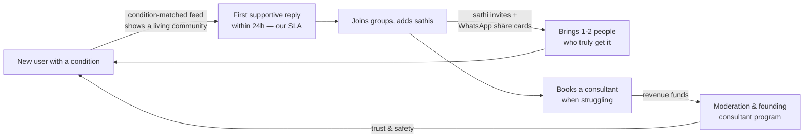
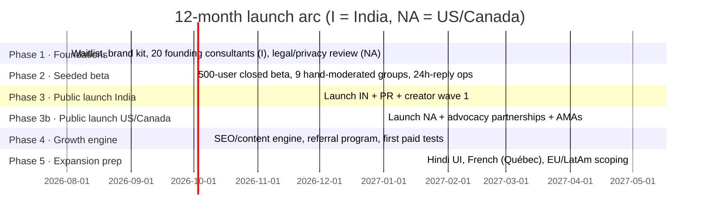

# HealingSathi — Go-to-Market & Growth Plan

_Owner: CMO · Written 2026-07-12 · Launch markets: **India, United States, Canada** → later Europe & Latin America._
_Companion assets: [`marketing/pitch-deck.md`](marketing/pitch-deck.md) (slide-by-slide deck) and `marketing/pitch-deck.html` (presentable visual deck)._

---

## 0. TL;DR

HealingSathi wins by being the **first moderated, trust-first support network for people living with chronic conditions** — community + verified professionals in one place. We do not out-spend Facebook or out-scale Reddit; we out-care them. The plan below is community-led growth with近 zero paid spend for the first two phases: seed 9 beachhead condition-communities by hand, convert their trust into word-of-mouth loops the product already has built in (sathi invites, post sharing, group proposals), then layer creators, SEO and partnerships. Paid acquisition only enters at Phase 4, after organic CAC benchmarks exist.

**North-star metric: Weekly Supportive Interactions (WSI)** — comments + replies + supports + chat messages received per active user per week. Users who *receive* support stay; downloads don't matter if nobody answers your first post.

---

## 1. Positioning & brand story

**"Sathi" (साथी) means companion.** That one word is the entire brand: healthcare has doctors and pills; it doesn't have companions. Our story writes itself in every market:

> *You were diagnosed. Everyone around you cares, but nobody __gets it__. HealingSathi is where the people who get it are.*

| | |
|---|---|
| **Category** | Peer-support health network (we create the shelf, we don't fight for one) |
| **One-liner** | *No one heals alone.* |
| **Promise** | A moderated, judgement-free space with people who share your condition — and verified professionals when you need more |
| **Personality** | Warm, honest, calm. Never clinical, never influencer-glossy. We say "hard day" not "patient journey" |
| **Proof points** | Human-reviewed groups & consultants (our superuser queue), condition-matched feed, real-name professionals, no ads in the feed |

**Positioning against alternatives** (this is the pitch, the App Store description, and every reply to "isn't this just…?"):

- *Facebook Groups*: unmoderated, your aunt sees your posts, algorithmic junk. **We are private-by-design and human-moderated.**
- *Reddit*: anonymous roulette — great threads, zero continuity of care. **We have persistent identity, sathis, and professionals one tap away.**
- *BetterHelp / telehealth*: transactional; you're alone between appointments. **We are the "between appointments" layer.**
- *PatientsLikeMe*: data-first, forum-era UX. **We are mobile-first and relationship-first.**

---

## 2. Who we're for (beachhead discipline)

We launch with **three conditions per market — not "everyone with a chronic illness."** Small ponds, total dominance, then adjacency expansion. Selection criteria: high daily burden (people seek support daily, not yearly), existing online community behavior, and comorbid anxiety/depression (activates our consultant marketplace).

| Market | Beachhead conditions | Why |
|---|---|---|
| 🇮🇳 India | **Type 2 diabetes, PCOS, thyroid disorders** | Massive prevalence (est. 100M+ diabetics), heavy WhatsApp-group behavior already exists, stigma makes anonymity-with-belonging valuable |
| 🇺🇸 US | **Fibromyalgia/chronic pain, Long COVID, endometriosis** | Deeply underserved by clinicians ("it's in your head"), hyper-active subreddit/Facebook communities, high willingness to pay for mental-health support |
| 🇨🇦 Canada | **Chronic pain, Long COVID** (shared English content with US) + French-ready later | Long specialist wait times (months) = huge "support while waiting" gap |

**Personas** (write every campaign for one of these, never "users"):
1. **The newly diagnosed** (0–6 months in): terrified, googling at 2am. Hook: *"Ask people who've lived it for years."*
2. **The veteran manager** (5+ years): wants to give back, becomes our moderator/creator class. Hook: *"Your experience is someone's lifeline."*
3. **The caregiver** (spouse/parent): forgotten by every health product. Hook: *"You need a sathi too."* (Also our expansion wedge — caregivers span all conditions.)

---

## 3. Market entry: what's different per country

### India — WhatsApp-first, trust-through-doctors
- **Distribution reality:** health communities in India live in WhatsApp groups and YouTube comments, not Reddit. Every share surface in the app must produce a WhatsApp-perfect card (link + hook line). Growth hack #1: offer existing WhatsApp diabetes/PCOS group admins a **branded, moderated home** — "graduate your group," admin becomes group moderator with status.
- **Credibility = doctors.** Indian users adopt what doctors endorse. Recruit 20 "Founding Consultants" (psychologists, diabetologists, gynecologists) pre-launch: free profile, "Founding" badge, they post one health tip a week. Their patients are our first users; their WhatsApp status is our first ad.
- **Language:** English UI at launch (urban Tier 1–2), but the **Language screen already exists** — Hindi first (differentiator vs. every US health app), then Tamil/Telugu/Bengali. Regional-language support posts are a moat nobody in the West can copy.
- **Pricing sensitivity:** consultations priced in ₹ with a visible "first session" discount; community stays free forever.

### US — community-led, privacy-forward
- **Distribution reality:** condition subreddits (r/Fibromyalgia ~100k+, r/covidlonghaulers, r/endometriosis) and Facebook groups. We don't spam them — we **earn** them: 90 days of genuinely useful participation from real team accounts, then "we built a thing" posts with mod permission, AMAs with our founding consultants.
- **Trust language:** privacy is the selling point. "No ads. No data selling. Human moderators." Health data anxiety is real post-Roe; say what we don't do, loudly. (Legal work item: HIPAA-adjacent positioning review before any "secure/private" claims in paid ads.)
- **Patient advocacy orgs** (nonprofits per condition) need member-engagement tools; offer free branded groups + co-marketing.

### Canada — the "waiting room" wedge
- **The insight:** Canadians wait months for specialists. Position as *"support while you wait"* — content and PR angle US media can't own. Partner with provincial patient associations; French UI unlocks Québec in Phase 4 (the language infra exists).

---

## 4. The growth flywheel (already built into the product)

Every loop above ships in the current build: condition-based feed discovery, sathi requests, in-app + WhatsApp post sharing, group proposals (users literally ask us to create their community), consultant applications feeding the superuser review queue.

**The 24-hour rule (our only unbreakable SLA):** every first post by a new user gets a genuine reply within 24 hours — from the community if possible, from our trained community team if not. This single operational habit is worth more than any ad budget; retention lives or dies on the first post.

---

## 5. Phased GTM plan

### Phase 1 — Foundations (Months 1–2) · $0–2k
- Waitlist site live (exists) → drive to it with a **condition quiz** ("Which support community fits your journey?") — shareable result cards.
- Recruit **20 Founding Consultants** (India) + **9 community moderators** (patient veterans, per beachhead condition) with real titles and equity-in-status: badge, launch-page credit, veto power over group rules.
- Brand kit: 30 shareable "support card" templates (quotes from real beta posts, anonymized with consent) — this is our entire early social content.
- App Store optimization groundwork: keyword research per condition ("fibromyalgia support," "PCOS community," "sugar patients support group India").

### Phase 2 — Seeded beta (Months 3–4) · $2–5k
- 500 hand-picked users (waitlist + moderator invites). Success bar to exit beta: **WSI ≥ 3** and **week-4 retention ≥ 35%** among posters.
- Every beta user gets a personal onboarding message from a human. Yes, manually. Do things that don't scale — this cohort becomes the testimonial engine.
- Collect 25 consented stories → the launch PR kit.

### Phase 3 — Public launches (Months 5–7) · $5–15k
- **India first** (bigger organic ceiling, cheaper ops): launch with the founding-consultant network posting simultaneously, WhatsApp graduation offers to 50 group admins, 10 micro-creators (health YouTubers/Instagrammers, 10k–100k followers — engagement over reach, ₹ affordable).
- **US/Canada 6 weeks later:** subreddit AMAs (earned, with mods), 5 patient-advocacy partnerships, podcast tour (chronic illness podcasts are numerous, cheap, and exactly our audience), Product Hunt for the tech-adjacent chronically ill (they exist and they're loud).
- PR angle everywhere: not "new app" but **"the loneliness epidemic has a treatment gap"** — pitch the story, the app is the resolution. Local angles: India = doctor shortage; Canada = wait times; US = medical gaslighting of women's pain.

### Phase 4 — Growth engine (Months 8–11) · scale with results
- **SEO/content:** the long game and our compounding asset. Public, indexable "community wisdom" pages (top anonymized threads per condition, with consent) target the 2am-google moment: "newly diagnosed fibromyalgia what now." 100 pages by month 10.
- **Referral program:** "Bring your sathi" — both sides get a free consultant session credit. Referral is emotionally native here: you literally know someone with your condition.
- **First paid tests** only now, only retargeting + lookalikes from organic converters; kill anything above blended CAC target (see §7).

### Phase 5 — Expansion prep (Months 12+)
- Hindi UI ships (existing language infra), French for Québec.
- EU scoping = GDPR work + UK/Germany chronic-pain communities; LatAm = Spanish + Brazil/Portuguese, WhatsApp playbook ports directly from India.

---

## 6. Channel playbook (priority order)

| # | Channel | Why it's ranked here | First move |
|---|---|---|---|
| 1 | **Community seeding** (Reddit/FB/WhatsApp) | Our exact users, already gathered, free | 90-day genuine-participation calendar per community |
| 2 | **Founding consultants & moderators** | Borrowed trust; India especially | 20 consultants + 9 moderators recruited in Phase 1 |
| 3 | **Product loops** (invites, shares, group proposals) | Compounds forever, already built | Instrument every loop; weekly k-factor review |
| 4 | **Micro-creators** (health & chronic-illness creators) | Authenticity beats reach in health | 10 India + 10 NA paid-in-product + small fees |
| 5 | **SEO / community-wisdom content** | Owns the 2am search moment; compounding | 100 consented thread pages by month 10 |
| 6 | **Partnerships** (advocacy orgs, clinics, campus health) | Institutional trust, bulk distribution | 5 org partnerships at NA launch |
| 7 | **PR / earned media** | Category-creation stories get written | Loneliness-gap narrative + founder story |
| 8 | **Paid** (Meta/Google/ASA) | Only after organic CAC benchmark exists | Phase 4 retargeting tests, hard CAC ceiling |

**What we will NOT do:** engagement-bait, fear-based health advertising, buying follower counts, unmoderated growth (a toxic viral moment in a health community is an extinction event — moderation capacity always scales *ahead* of user growth).

---

## 7. Metrics & targets

**North star: Weekly Supportive Interactions (WSI)** — support received per weekly-active user.

| Metric | Beta exit (M4) | India launch +90d | NA launch +90d | Month 12 |
|---|---|---|---|---|
| Registered users | 500 | 25,000 | 50,000 total | **150,000 total** |
| WAU/MAU | ≥ 45% | ≥ 40% | ≥ 40% | ≥ 45% |
| WSI (per WAU) | ≥ 3 | ≥ 2.5 | ≥ 2.5 | ≥ 4 |
| First-post reply < 24h | 100% | ≥ 95% | ≥ 95% | ≥ 95% |
| Week-4 retention (posters) | ≥ 35% | ≥ 30% | ≥ 30% | ≥ 40% |
| Consultant booking rate (MAU) | — | 1% | 2% | 3% |
| Referral k-factor | measure | ≥ 0.3 | ≥ 0.35 | ≥ 0.5 |
| Blended CAC (when paid starts) | — | — | — | < ⅓ of 12-mo LTV |

*(User-number targets are ambitions to plan capacity against, not forecasts — the retention and WSI bars are the ones we hold sacred; scale follows health.)*

---

## 8. Budget scenarios (monthly, marketing only)

| | **Bootstrap** ($0–2k/mo) | **Seed-funded** ($10k/mo) | **Post-raise** ($40k/mo) |
|---|---|---|---|
| Community ops & 24h-reply team | founders + volunteers | 2 part-time community managers (1 IN, 1 NA) | 4 FTE + moderator stipends |
| Creators | product credits only | $4k micro-creator fees | $15k creator program |
| Content/SEO | founder-written | $2k freelance writers (patient-writers preferred) | $8k content studio |
| Partnerships/PR | founder outreach | $1k tools + events | $5k PR retainer |
| Paid | $0 | $2k tests (Phase 4 only) | $10k performance |
| Tools/analytics | free tiers | $1k | $2k |

The plan is designed to work at the bootstrap tier; money accelerates it but doesn't unlock it.

---

## 9. Trust & safety IS marketing

In this category, safety failures are churn events *and* press events. Budget and staff these as marketing line items:
- Moderator coverage in every group across IN + NA time zones (the superuser review queue is built; staff it).
- Crisis-resource interstitials (self-harm keyword detection → helpline cards per country) — required before NA launch.
- "How we keep this space safe" public page; link it in every store listing and press kit.
- Verified-consultant process documented publicly (application → human review → badge). Our review queue is a feature; brag about it.

---

## 10. Team & operating cadence

- **Now:** founder as CMO + 9 volunteer moderators + 20 founding consultants.
- **First marketing hires (in order):** ① Community lead – India, ② Community lead – NA, ③ Content lead (a patient-writer, not a generalist), ④ Growth analyst (Phase 4, when paid starts).
- **Cadence:** weekly growth review (WSI, retention, k-factor, 24h-reply compliance), monthly channel re-rank (kill bottom channel, double top), quarterly narrative refresh.

## 11. Risks & pre-committed responses

| Risk | Response (decided now, not in the moment) |
|---|---|
| Toxic content / medical misinformation goes viral | Kill-switch: group freezes + statement template pre-written; misinformation policy public from day 1 |
| Slow organic start | We do NOT panic-buy ads; we narrow to fewer conditions and go deeper |
| Consultant supply outpaces demand (or vice-versa) | Waitlist consultants; throttle applications via the review queue |
| Big platform copies us (FB "Health Communities") | Our moat is moderation quality + condition depth, not features; double down on the 24h rule |
| Regulatory (health claims, data) | No outcome claims ever; privacy review before each market's paid launch |

---

*Appendix: the investor-facing version of this story lives in [`marketing/pitch-deck.md`](marketing/pitch-deck.md), with a presentable HTML deck at `marketing/pitch-deck.html`.*
